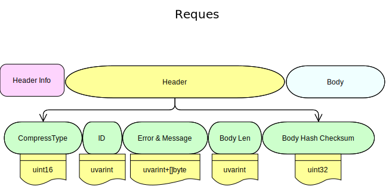

# TRPcG

---

## What is TRPcG

TRPcG is short for "Tiny Remote Procedurecall in Go".

It's a light weight `net/rpc`-based RPC framework which can help people better understand RPC.

- TPC protocol based
- Support for multiple compression formats : gzip, snappy, zlib, etc.
- Implemented protocol buffer. May be cross-platform in future.
- protoc-gen-trpcg plug-in allows you define your own service.
- Support for custom event serialization.

## Licensing

This project is governed by [MGPL v1.2](/License/Mizumoto%20General%20Public%20License%20v1.2.md) as usual, which is basically a [Mozillia Public License 2.0 (mpl-v2.0)](/License/mpl-v2.0.md) with extra restrcitions.

## Structure

TRPcG Client will send request messages, and which will be three parts: an unsigned-int Header Info, a Header, and a Body based on [Protocol Buffers (Google Developers)](https://developers.google.com/protocol-buffers/docs/gotutorial)

Here is a picture of the Request Stream:

> `uvarint` is just like a variable-length unsigned-integer. It's an encoding of 64-bit unsigned integers into between 1 and 9 bytes.

The **Header** is based on a contomised protocol.

**ID** is like a serial code of the RPc call, with which in conccurrent cases, clients can determine whether it's a successful call based on the ID serial number of the response.

### Header

So now lets talk about the `Header`, which will be defined in [/header/header.go](/header/header.go)

