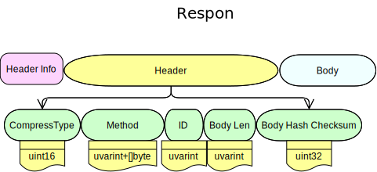

# TRPcG

[](/License/Mizumoto%20General%20Public%20License%20v1.2.md)
[](#What) <!--(https://www.rt.com/)-->

[](https://github.com/mizumoto-cn/TRPG/actions)
[](https://goreportcard.com/report/github.com/mizumoto-cn/TRPcG)
[](https://www.codefactor.io/repository/github/mizumoto-cn/trpcg)
[](https://codecov.io/gh/mizumoto-cn/TRPcG)

<!-- markdownlint-disable no-hard-tabs -->

---

## What is TRPcG ✈

TRPcG is short for "Tiny Remote Procedure-call in Go", a fast, stable, light-weight and high-performance RPC framework for Go.

It's also a example `net/rpc`-based RPC framework which can help people better understand RPC.

- TCP based
- Support for multiple compression formats : gzip, snappy, zlib, etc.
- Implemented protocol buffer. May be cross-platform in future.
- protoc-gen-trpcg plug-in allows you define your own service.
- Support for custom serialization. See [Customize](#Customize)

## Install & Quick Start

- install `protoc` at <https://github.com/google/protobuf/releases>
- install `protoc-gen-go` and `protoc-gen-trpcg`

```bash
go install github.com/golang/protobuf/protoc-gen-go
go install github.com/mizumoto-cn/TRPcG/proto-gen-trpcg
```

Then you'll need to create a `arith.proto` file to define the rpc services.

Use `protoc` to generate code:

```bash
protoc --trpcg_out=. arith.proto --go_out=. arith.proto
```

Two files will be generated in the directory `message`: `arith.pb.go` and `arith.svr.go`

Then you need a new `main.go` like [main.go.bak](main.go.bak)

> Noted that you'll need to change the import `"demo/message"` to `"github.com/mizumoto-cn/TRPcG/testing/message"` in `main.go`

After that you can implement your rpc client like [clientmain.go.bak](clientmain.go.bak):

```golang
...
conn, err := net.Dial("tcp", ":8082")
if err != nil {
    log.Fatal(err)
}
defer conn.Close()
client := TRPcG.NewClient(conn)
req := &message.ArithRequest{ A: 1, B: 2 }
res := &message.ArithResponse{}
err = client.Call("Arith.Add", &req, &res)
log.Printf("%d + %d = %d, %v", req.A, req.B, res.C, err)
...
```

You may suppose to see the result like:

```bash
PS D:\Reposits\Tiny-RPc-Go\testing\client> go run .
2023/10/15 12:26:00 Arith.Add(20, 5): 25 ,Error: <nil>
```

You may also use `AsyncCall` to get a asynchronous return in the form of `*rpc.Call`

```golang

result := client.AsyncCall("ArithService.Add", &resq, &resp)
select {
case call := <-result:
	log.Printf("Arith.Add(%v, %v): %v ,Error: %v", resq.A, resq.B, resp.C, call.Error)
case <-time.After(100 * time.Microsecond):
	log.Fatal("time out")
}
```

## Customize

### Compressor

You can choose to use 'gzip', 'snappy', 'zlib', or 'raw' to compress the data.

Like:

```golang
import "github.com/mizumoto-cn/TRPcG/compressor"

...
client := TRPcG.NewClient(conn, TRPcG.WithCompress(compressor.Gzip))
```

### Serializer

You'll need to implement `Serializer` interface to use customized serialization.

```golang
type Serializer interface {
    Serialize(interface{}) ([]byte, error)
    Deserialize([]byte, interface{}) error
}
```

Here is a simple implementation of `Serializer` in `json` format:

```golang

type JsonSerializer struct {}

func (s *JsonSerializer) Serialize(v interface{}) ([]byte, error) {
    return json.Marshal(v)
}

func (s *JsonSerializer) Deserialize(b []byte, v interface{}) error {
    return json.Unmarshal(b, v)
}
```

And we can use it to define a `service` like:

```golang
type JsonRequest struct {
	Req string `json:"req"`
}

type JsonResponce struct {
	Res string `json:"res"`
}

type RepeatService struct{}

func (_ *JsonService) Repeater(args *JsonRequest, reply *JsonResponse) error {
	reply.Res = args.Req
	return nil
}
```

Also, we'll have to assign `json` serializer to `server`:

```golang
listener, err := net.Listen("tcp", ":8082")
if err != nil {
    log.Fatal(err)
}
server := TRPcG.NewServer(listener, TRPcG.WithSerializer(&JsonSerializer{}))
server.Register(&JsonService{})
server.Serve(listener)
```

Remember your client also need to assign `json` serializer when you create it:

```golang
client := TRPcG.NewClient(conn, TRPcG.WithSerializer(&JsonSerializer{}))
```

## Architecture

TRPcG Client will send request messages, and which will be three parts: an unsigned-int Header Info, a Header, and a Body based on [Protocol Buffers (Google Developers)](https://developers.google.com/protocol-buffers/docs/gotutorial)

Here is a picture of the Request Stream:




> `uvarint` is just like a variable-length unsigned-integer. It's an encoding of 64-bit unsigned integers into between 1 and 9 bytes.

The `Header` is based on a customized protocol.

`ID` is like a serial code of the rpc calls, with which in concurrent cases, clients can determine whether it's a successful call based on the ID serial number of the response.

for more architecture info, goto [wiki](doc/Architecture.md)

## License

This project is governed by [Mizumoto General Public License v1.2](License/Mizumoto%20General%20Public%20License%20v1.2.md). Basically a Mozilla 2.0 public license, but with extra restrictions:

By using any part of this project, you are deemed to have fully understanding and acceptance of the following terms：

1. You must conspicuously display, without modification, this License and the notice on each redistributed or derivative copy of the License Covered Work.
2. Any non-independent developers companies/groups/legal entities or other organizations should ensure that employees are not oppressed or exploited, and that employees can always receive a reasonable salary for their legal working hours.
3. Any independent or non-independent developers/companies/groups/legal entities or other organizations, shall ensure that it has a clear conscience, including and not limited to **opposition to any form of Nazi or Neo-Nazism organization(s)**.

Otherwise these Individuals / Companies / Groups / Legal-entities **will not have the right to copy / modify / redistribute any code / file / algorithm** governed by MGPL v1.2.
